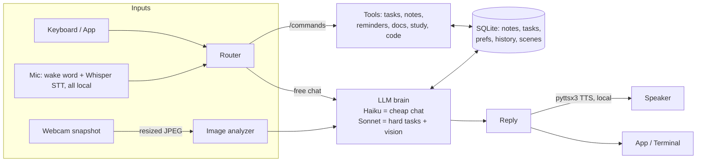

# JARVIS — Desk Assistant

A cheap, buildable, privacy-conscious AI assistant that lives on your desk. Say **"jarvis"**
and talk to it. It sees your desk through a webcam, answers through your speaker, and helps
with university work, coding, and personal projects — with a calm, slightly witty persona.
Runs as a desktop app on **macOS and Windows** (Linux and Raspberry Pi too).

No coding is required to set it up or use it. If you can install an app and click through a
settings screen, you can run JARVIS.

---

## New here? Start in this order

1. **[docs/HARDWARE.md](docs/HARDWARE.md)** — what to buy (~$50–70: a webcam and a USB
   speakerphone; your existing computer does the thinking).
2. **[docs/BUILD_CHECKLIST.md](docs/BUILD_CHECKLIST.md)** — your complete to-do list, from
   ordering parts to the first conversation. Nothing on it involves code.
3. **Your OS guide in [setup/](setup/)** — copy-paste install commands for
   [Windows](setup/setup_windows.md) · [macOS](setup/setup_macos.md) ·
   [Linux](setup/setup_linux.md) · [Raspberry Pi](setup/setup_raspberry_pi.md).
4. **[docs/USER_GUIDE.md](docs/USER_GUIDE.md)** — how to actually use JARVIS day-to-day:
   talking to it, every command explained, study workflows, memory control.
5. Something not working? **[docs/TROUBLESHOOTING.md](docs/TROUBLESHOOTING.md)**.

## The 10-minute version

On a computer with [Python 3.10+](https://python.org) and [Git](https://git-scm.com) installed:

```bash
git clone <this-repo-url> JARVIS && cd JARVIS
python3 -m venv .venv
source .venv/bin/activate          # Windows PowerShell: .venv\Scripts\activate
pip install -r requirements.txt
python run_app.py                  # opens the JARVIS desktop app
```

Then, **inside the app**:

1. Click **Settings** (top-left).
2. Paste your Claude API key (free to create at [console.anthropic.com](https://console.anthropic.com);
   typical cost $5–10/month — see [docs/COST_CONTROL.md](docs/COST_CONTROL.md)).
   *Have a Claude Pro subscription?* You can run the brain on it instead of (or alongside)
   the API — Settings → Brain source, explained in
   [docs/COST_CONTROL.md](docs/COST_CONTROL.md#already-paying-for-claude-pro-use-it-as-the-brain).
3. Pick your **microphone**, **speaker**, and **camera** from the dropdowns — real device
   names, no guessing at index numbers.
4. Click **Save & Apply** (changes are live in about a second — no restart).
5. Run the four **Device test** buttons at the bottom: 🔊 speaker, 🎤 microphone, 📷 camera,
   🧠 API key. Each one tells you exactly what to fix if it fails.

That's the whole setup. No file editing — the Settings page manages the config for you.
(Prefer files? Copy `.env.example` to `.env` and edit it; the app and the files stay in sync.)

**Make it feel like an app:** double-click `launchers/JARVIS.command` on Mac
(run `chmod +x launchers/JARVIS.command` once first) or `launchers/JARVIS.bat` on Windows
(right-click → Send to → Desktop for a shortcut).

## Your first conversation

With the app open (or `python run_assistant.py` in a terminal):

| Try | What happens |
|---|---|
| Say **"jarvis"**, wait for the beep, ask *"what's on my desk?"* | It photographs the desk and describes it out loud |
| Say **"jarvis"**, then *"shutdown"* | Microphone turns fully off (`MIC OFF` in the header) |
| Type anything | Microphone re-arms — say "jarvis" again anytime |
| Type `/task finish lab report due friday` | Task saved; it appears in the sidebar |
| Type `/note tutor said use APA 7` then `/notes` | Note saved and listed |
| Type `/remind 25m stretch` | A spoken reminder fires in 25 minutes |
| Type `/desk`, move something, `/desk` again, then `/changes` | "appeared: …; gone: …" |
| Type `/flashcards TCP three-way handshake` | Instant practice flashcards |
| Type `tidy my Downloads folder into subfolders` | It plans, asks permission for each change, then does it |
| Type `/help` | The full command list |

Anything you type or say **without** a `/` is normal conversation with the AI — it knows
your open tasks, recent notes, and the latest desk snapshot. The complete manual, including
study workflows and PDF/project features, is **[docs/USER_GUIDE.md](docs/USER_GUIDE.md)**.

## What it can do

- **Talk hands-free** — local wake-word detection ("jarvis"), local speech-to-text, offline
  text-to-speech; `/stop` interrupts it mid-sentence.
- **See your desk** — `/desk` describe, `/look where are my keys?`, `/read` a held-up page,
  `/ocr` free local text reading, `/changes` what moved since last time.
- **Remember, on your terms** — notes, tasks, reminders; long-term facts stored only via
  `/remember`, listed with `/memories`, deleted with `/forget`.
- **Help you study** — `/plan` assignment milestones, `/flashcards`, `/explain`,
  `/timetable`, `/cite`, `/doc` PDF summaries + follow-up Q&A.
- **Help you build** — `/project` loads a code folder for Q&A, `/code` debugs with
  explanations, `/run` executes small Python snippets in a sandbox.
- **Use your computer & apps — just by asking** — *"tidy my Downloads folder"*, *"check my
  email for anything from my tutor"*, *"what's in my uni folder?"*. When a request needs
  real action, JARVIS uses your files, shell, and connected apps (Gmail, calendar, … via
  MCP) automatically, step by step — with approval prompts before anything risky, a folder
  allowlist, and an "Actions taken" log on every reply. Setup & safety model:
  [docs/COMPUTER_AND_APPS.md](docs/COMPUTER_AND_APPS.md).

**What it won't do:** write assignments/essays for submission, answer quizzes or exams, or
help disguise AI work as yours. It's a tutor, not a ghostwriter — it declines and offers the
legitimate version (outline, feedback, explanation) instead. It also never records
continuously and never stores camera images long-term.

## Three ways to run it

| Command | What you get |
|---|---|
| `python run_app.py` | **The desktop app** — chat + settings in a native window (recommended) |
| `python run_assistant.py` | Terminal version — same brain, plus `--check` self-test |
| `python run_dashboard.py` | Browser version at http://127.0.0.1:8321 — same app as `run_app.py` |

All three share the same memory database. Run one at a time (they'd compete for the mic).

## Architecture (for the curious)



**Local & free:** wake word, speech-to-text, text-to-speech, OCR, camera, database, settings
app, all task/note logic. **Cloud & paid:** the Claude API for chat and image understanding —
the only paid piece, with cost controls built in (cheap-model routing, image downscaling,
trimmed context). Deep dive: [docs/ARCHITECTURE.md](docs/ARCHITECTURE.md).

## Repository layout

```
run_app.py              desktop app (native window: chat + settings) — start here
run_assistant.py        terminal front-end (+ --check self test)
run_dashboard.py        browser version of the app
launchers/              double-clickable starters for Mac (.command) and Windows (.bat)
app/
  assistant.py          core: wires everything, registers all /commands
  config.py             settings loader (.env) with safe defaults
  prompts.py            JARVIS persona + vision prompts + integrity rules
  audio/                voice_loop (wake word), push_to_talk, STT, TTS
  vision/               camera, image_analyzer, ocr, scene_memory
  brain/                llm_client (model routing), router, agent (computer use),
                        mcp_client (connected apps), tool_manager
  memory/               database (SQLite), notes, preferences
  tools/                tasks, reminders, documents, project_files, study_tools, code_helper
  dashboard/            the app UI: chat page, settings page, device tests
  tests/                pytest suite (runs with zero devices and zero keys)
setup/                  per-OS install guides
docs/                   user guide, hardware, architecture, cost, troubleshooting, checklist
data/                   created at runtime (DB, snapshots, logs) — gitignored, deletable
```

## Tests

```bash
python -m pytest app/tests -q
```

52 tests covering config, memory, tasks/reminders, scene memory, LLM fallback, documents,
study tools, the voice loop, and the settings app. All pass with no camera, no mic, and no
API key.

## Privacy model

- **Camera:** turns on only for explicit commands (`/desk`, `/snapshot`, …) with a visible
  `CAMERA ACTIVE` indicator; snapshots auto-delete after a retention period you control
  (Settings → Camera & Vision); long-term memory keeps text descriptions, never images.
- **Microphone:** hands-free mode streams audio **only to score the wake word locally** —
  chunks are checked and discarded, nothing stored or uploaded until you say "jarvis".
  Saying "shutdown" closes the device entirely. Turn hands-free off in Settings for strict
  push-to-talk-only operation.
- **Memory:** long-term facts are stored only when you ask (`/remember`), and `/memories` /
  `/forget` give you full inventory and deletion.
- **Cloud:** your message text and (for vision commands only) one downscaled snapshot go to
  the Claude API. Raw audio never leaves the machine. Full trade-offs:
  [docs/ARCHITECTURE.md](docs/ARCHITECTURE.md#privacy-trade-offs).

## What's next after setup

1. Live with it for a week; tune wake sensitivity and voice speed in Settings.
2. Nicer voice: `pip install edge-tts` (free Microsoft neural voices — swap noted in
   [docs/TROUBLESHOOTING.md](docs/TROUBLESHOOTING.md#tts-sounds-robotic)).
3. Bigger ideas: calendar integration, web search tool, a dedicated mini-PC or Pi so JARVIS
   is always on ([setup/setup_raspberry_pi.md](setup/setup_raspberry_pi.md)).
