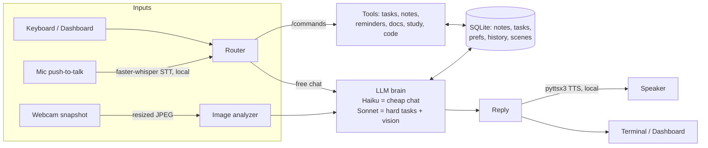

# JARVIS — Desk Assistant

A cheap, buildable, privacy-conscious AI desk assistant. It sees your desk through a webcam,
listens via push-to-talk, talks back through a speaker, and helps with university work,
coding, and personal projects — with a calm, slightly witty JARVIS-style persona.

**Role split:** all software in this repo is complete and runnable. Your job is only the
physical side: buy hardware, plug things in, run the commands below, and paste in one API key.

---

## What it does (MVP)

- **Chat**: typed (terminal or web dashboard) or spoken (push-to-talk) conversation with a
  Claude-powered brain that knows your notes, tasks, and latest desk snapshot.
- **Vision**: `/desk` photographs your desk and describes it; `/look where is my calculator?`;
  `/read` reads a page you hold up; `/changes` tells you what changed since last time.
- **Voice**: hands-free mode — say **"jarvis"** to talk (local wake-word detection, works
  on macOS/Windows/Linux/Pi), say **"shutdown"** to close the mic completely, type anything
  (or `/listen`) to re-arm it. Plus push-to-talk (`/voice`), offline speech-to-text
  (faster-whisper), offline text-to-speech (pyttsx3), and `/stop` to cut speech off.
- **Memory**: notes, tasks, reminders, and long-term preferences — stored **only** when you
  ask, listed with `/memories`, deleted with `/forget`. Everything lives in one local SQLite file.
- **Uni tools**: `/plan` (assignment planner), `/flashcards`, `/explain`, `/timetable`,
  `/cite`, `/doc` (PDF summariser), `/project` (project-folder Q&A), `/code`, `/run`.

**Non-goals / integrity:** it will not write assignments for submission, answer quizzes/exams,
or help pass off AI work as yours. It tutors, explains, plans, reviews, and debugs. It also
never records continuously — camera and mic activate only on explicit commands, with visible
`[CAMERA ACTIVE]` / `[MIC ACTIVE]` indicators in the terminal and dashboard.

---

## Quick start (any OS)

```bash
git clone <this repo> && cd JARVIS
python3 -m venv .venv
source .venv/bin/activate        # Windows: .venv\Scripts\activate
pip install -r requirements.txt  # audio/vision extras are optional — see setup/ guides
cp .env.example .env             # then paste your ANTHROPIC_API_KEY into .env
python run_assistant.py --check  # first-run self test with per-component fix hints
python run_app.py                # ← the desktop app (chat + settings in one window)
python run_assistant.py          # terminal assistant (same brain)
python run_dashboard.py          # browser version of the app
```

**Desktop app:** `run_app.py` opens JARVIS in its own native window on macOS and Windows.
Double-clickable launchers are in [`launchers/`](launchers/) — `JARVIS.command` (Mac,
`chmod +x` it once) and `JARVIS.bat` (Windows, right-click → Send to → Desktop for a
shortcut). The app's **Settings page** lets you change everything without touching a file:
pick your microphone/speaker/camera by name, paste the API key, tune the wake word, then
hit *Save & Apply* — changes go live instantly, and each device has a Test button that
tells you exactly what's wrong if it fails.

No API key? Everything local still works (notes, tasks, snapshots, OCR, reminders) and the
assistant tells you exactly what to add to enable the brain. Detailed per-OS instructions,
including microphone/camera permission steps: [`setup/`](setup/).

## First demo (proves the whole MVP)

Run `python run_assistant.py`, then:

| Step | Type this | You should see/hear |
|---|---|---|
| 1 | `hello, introduce yourself` | A short spoken JARVIS-style reply |
| 2 | `/snapshot` | `[CAMERA ACTIVE]` then a saved photo path |
| 3 | `/desk` | A spoken description of what's on your desk |
| 4 | `/look where is my phone?` | A location answer ("left of the keyboard…") |
| 5 | `/note check tutorial times` then `/notes` | The note saved and listed |
| 6 | `/task finish lab report due friday` then `/tasks` | The task with its due date |
| 7 | `/remind 1m stand up` and wait a minute | A spoken reminder fires |
| 8 | (move something on the desk) `/desk` then `/changes` | "appeared: … / gone: …" |
| 9 | `/voice`, speak, press Enter | Your words transcribed and answered |
| 10 | Say **"jarvis"**, wait for the beep, ask something | Hands-free answer, no typing |
| 11 | Say **"jarvis"**, then **"shutdown"** | `[MIC OFF]` — mic fully released; type anything to re-arm |

## Commands

Type `/help` for the live list. Highlights:

```
/desk /snapshot /read /ocr /look /changes /scenes      vision
/note /notes /remember /memories /forget               memory (user-controlled)
/task /tasks /done /remind /reminders                  productivity
/doc /docq /project /projq                             documents & code projects
/plan /flashcards /explain /timetable /cite            uni tools
/code /run                                             coding help + sandboxed runner
/listen /sleep /voice /stop /status /clear             voice & control
```

Anything without a `/` goes straight to the AI brain. Natural phrases like
"what's on my desk" or "stop talking" route automatically.

## Architecture



**Local (free):** STT, TTS, OCR, camera capture, database, dashboard, routing, task/note logic.
**Cloud (paid, one key):** Claude API for chat and image understanding — the only paid piece.
Cost controls are built in: cheap-model routing, image downscaling before upload, trimmed
conversation context, and local pre-checks that avoid API calls entirely. Full details:
[`docs/ARCHITECTURE.md`](docs/ARCHITECTURE.md) and [`docs/COST_CONTROL.md`](docs/COST_CONTROL.md).

## Hardware

Start with **Tier B**: any existing laptop/desktop + a 1080p USB webcam (~$25) + a USB
speakerphone puck (~$25–35), total **~$50–60** if you already own a computer. Don't buy a
Raspberry Pi, wake-word button, or LED ring yet. Full bill of materials with three tiers,
shopping search terms, what to avoid, and camera/mic placement: [`docs/HARDWARE.md`](docs/HARDWARE.md).
Your physical to-do list: [`docs/BUILD_CHECKLIST.md`](docs/BUILD_CHECKLIST.md).

## Repository layout

```
run_app.py              desktop app (native window: chat + settings)
run_assistant.py        terminal front-end (+ --check self test)
run_dashboard.py        web dashboard front-end
launchers/              double-clickable starters for Mac (.command) and Windows (.bat)
app/
  assistant.py          core: wires everything, registers all /commands
  config.py             .env loader with safe defaults
  prompts.py            JARVIS persona + vision prompts + integrity rules
  logger.py             console + rotating file logs (data/logs/)
  audio/                push_to_talk, speech_to_text, text_to_speech, wake_word
  vision/               camera, image_analyzer, ocr, scene_memory
  brain/                llm_client (model routing), router, tool_manager
  memory/               database (SQLite), notes, preferences
  tools/                tasks, reminders, documents, project_files, study_tools, code_helper
  dashboard/            Flask server + chat page + settings app (schema-driven)
  tests/                pytest suite (runs with zero devices and zero keys)
setup/                  per-OS install guides (Windows/macOS/Linux/Raspberry Pi)
docs/                   hardware BOM, architecture, cost control, troubleshooting, checklist
data/                   created at runtime (DB, snapshots, logs) — gitignored, never committed
```

## Tests

```bash
python -m pytest app/tests -q
```

37 tests covering config, memory, tasks/reminders, scene memory, LLM fallback, document
ingestion, and study tools. They run with no camera, no mic, and no API key — CI-safe.

## Privacy model

- Camera is **command-triggered only**; visible active-state indicators everywhere.
- Hands-free mode streams the mic **only to score the wake word locally** — chunks are
  discarded immediately, nothing is stored or uploaded until you say "jarvis". Saying
  "shutdown" (or `/sleep`) **closes the microphone device entirely** (`[MIC OFF]`);
  the `[MIC ACTIVE]` banner shows whenever it's open. Set `WAKE_WORD_ENABLED=false`
  for strict push-to-talk-only operation.
- Snapshots auto-delete after `SNAPSHOT_RETENTION_DAYS` (set `0` to keep none); long-term
  scene memory stores text descriptions, never images.
- Long-term memory is opt-in per item and fully listable/deletable by you.
- What goes to the cloud: your typed/transcribed text and (only for vision commands) one
  downscaled snapshot per command. Audio never leaves the machine. Trade-offs discussed in
  [`docs/ARCHITECTURE.md`](docs/ARCHITECTURE.md#privacy-trade-offs).

## Upgrades after the MVP

Already scaffolded in the codebase, in recommended order:

1. **Voice polish** — nicer TTS voices (edge-tts), audio device selection
   (`python -m app.audio.push_to_talk --list`). Wake word is already built in.
2. **Vision polish** — local OCR (`/ocr`, install tesseract), tighter retention settings.
3. **Bigger brain features** — calendar integration, web search tool, GitHub awareness.

Something broken? [`docs/TROUBLESHOOTING.md`](docs/TROUBLESHOOTING.md) has fixes for every
common failure (camera index, mic permissions, audio on Linux, Pi performance, API errors).
