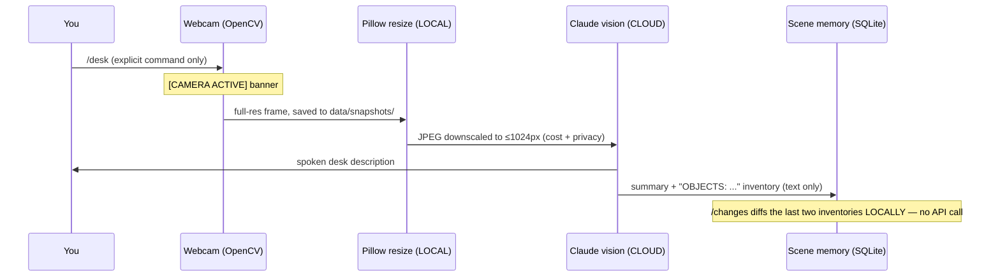

# Architecture & AI model strategy

## Plain-English overview

One Python process is the assistant (`app/assistant.py`). Two thin front-ends drive it: a
terminal loop (`run_assistant.py`) and a local Flask dashboard (`run_dashboard.py`). Input —
typed, or recorded via push-to-talk and transcribed locally — goes to a **router**: slash
commands run local tools directly; everything else goes to the **LLM brain** with a compact
context block (latest desk summary, open tasks, recent notes, approved preferences, last N
conversation turns). Replies print to screen and are optionally spoken by a local TTS engine.
All state lives in one SQLite file you can copy, inspect, or delete.

## Voice data flow

```mermaid
sequenceDiagram
    participant U as You
    participant M as Mic (sounddevice)
    participant W as faster-whisper (LOCAL)
    participant A as Assistant/Router
    participant C as Claude API (CLOUD)
    participant T as pyttsx3 TTS (LOCAL)
    U->>M: /voice, press Enter, speak, Enter
    Note over M: [MIC ACTIVE] banner shown
    M->>W: float32 audio buffer (never leaves machine)
    W->>A: transcript text
    A->>C: text + trimmed context (only free-chat; commands stay local)
    C->>A: reply text
    A->>T: reply
    T->>U: spoken audio (interruptible with /stop)
```

## Vision data flow



## What runs where

| Layer | Where | Cost |
|---|---|---|
| Speech-to-text (faster-whisper) | Local | Free |
| Text-to-speech (pyttsx3) | Local | Free |
| OCR (`/ocr`, tesseract) | Local | Free |
| Camera capture, resize, retention pruning | Local | Free |
| Router, tasks, notes, reminders, scene diffing, sandboxed `/run` | Local | Free |
| SQLite memory + dashboard | Local | Free |
| Chat brain, desk description, `/read`, doc summaries | Claude API | The only paid piece |

**Cheapest functional setup:** no API key at all — notes, tasks, reminders, snapshots, OCR
and the dashboard work; chat replies explain what's missing. **The real setup:** one
Anthropic API key (~$3–8/month typical student use). **Fully-local alternative:** point
`llm_client.py` at Ollama (llama3.1-8b) — free but much weaker and no vision-quality parity;
not the default because the brain is where quality matters most.

## Model strategy & cost control

Two models, routed automatically in `app/brain/llm_client.py`:

- **Fast/cheap (claude-haiku-4-5):** everyday chat, quick questions, task phrasing.
- **Smart (claude-sonnet-5):** anything with an image, `/doc`, `/projq`, `/code`, `/plan`,
  long pasted content (>600 chars), or "hard" keywords (debug, derive, refactor…).

Built-in cost reducers:

1. **Local preprocessing** — STT, OCR, scene diffing, and integrity pre-checks never hit the API.
2. **Images only on demand** — one downscaled (≤1024px, q85 JPEG) image per vision command;
   `/changes` reuses stored text instead of re-sending photos.
3. **Short prompts** — context block caps (5 tasks, 3 notes, 10 prefs), history trimmed to
   `MEMORY_CONTEXT_TURNS` (default 12), replies capped at `LLM_MAX_TOKENS` (default 1024).
4. **Cheap-by-default routing** with escalation only when heuristics say the task is hard.
5. **Free fallbacks** — `/ocr` (local tesseract) vs `/read` (cloud vision); use the free one
   for clean printed text.

## Privacy trade-offs

Sending data to a cloud API is the price of a strong brain. What this design does about it:

- **Audio: never uploaded.** Transcription is local; only the resulting *text* goes to the API.
- **Images: only on explicit vision commands**, downscaled first, deleted from disk after
  `SNAPSHOT_RETENTION_DAYS` (set `0` for delete-after-analysis). Long-term memory keeps text
  descriptions, never pixels. Keep the camera aimed at the desk surface, not at people or
  housemates' space.
- **Text: your messages and stored context go to the API** — don't paste secrets/passwords
  into chat. Anthropic's API terms do not train on API data by default, but treat any cloud
  service as "someone else's computer".
- **Nothing is always-on.** Push-to-talk opens the mic per-utterance. The optional wake-word
  mode keeps the mic streaming (processed locally, clearly labelled) and is off by default.
- **Everything visible:** `[CAMERA ACTIVE]`/`[MIC ACTIVE]` banners in the terminal; red
  CAMERA ACTIVE pill in the dashboard header; `/status` shows every device's state.
- **Memory under your control:** `/memories` lists all long-term facts, `/forget` deletes,
  and nothing is stored long-term without your explicit `/remember`.
